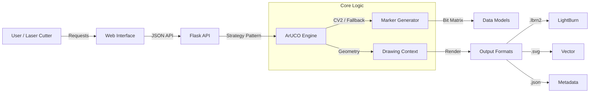

# ArUCO Generator


**Professional Computer Vision Marker Generation Suite.**
A robust, high-performance tool for generating ArUCO markers, ChArUco calibration boards, and AprilTags with native LightBurn integration.

---

## 🏗️ Architecture



---

## 🚀 Quick Start

**Prerequisites**: Python 3.11+, Make.

### 1. Install
```bash
make install
```

### 2. Run
```bash
make run
```
*Access the application at `http://localhost:5000`*

---

## 🧩 Core Modules

| Component | File | Responsibility |
| :--- | :--- | :--- |
| **Engine** | `aruco_generator/core/aruco.py` | Core CV algorithms. Handles fallback logic gracefully. |
| **API** | `aruco_generator/web/web.py` | RESTful endpoints for generation and preview. |
| **Validation** | `aruco_generator/validation/validation.py` | Quality assurance and Hamming distance checks. |
| **Client** | `static/js/core/api.js` | Class-based frontend API client (`ArUCOAPI`). |
| **Map** | `AI_NAVIGATION.xml` | **The Source of Truth** for codebase structure. |

---

## 🤖 For AI Agents

If you are an AI assistant working on this repository, you **MUST** read:

👉 **[AGENTS.md](AGENTS.md)**

 This file contains:
-   **The Prime Directive**: Your operational protocols.
-   **Navigation**: How to use `AI_NAVIGATION.xml`.
-   **Workflows**: Mandatory validation steps (`make validate`).

*Do not attempt to modify this codebase without consulting `AGENTS.md`.*

---

## 🛠️ Development

We use `make` for all lifecycle events.

| Command | Action |
| :--- | :--- |
| `make validate` | **Run full CI suite** (Format Check + Lint + Unit + Integration + UI + QA). Required before commit. |
| `make format` | Auto-format code with Black/Isort. |
| `make test` | Run unit + integration + UI tests. |
| `make test-qa` | Run quality + export tests. |
| `make clean` | Remove build artifacts and caches. |

## 📋 Deployment Checklist

See `docs/deployment_checklist.md` for pre-release and deployment steps.

---

## 📄 License

MIT License. See [LICENSE](LICENSE) for details.
